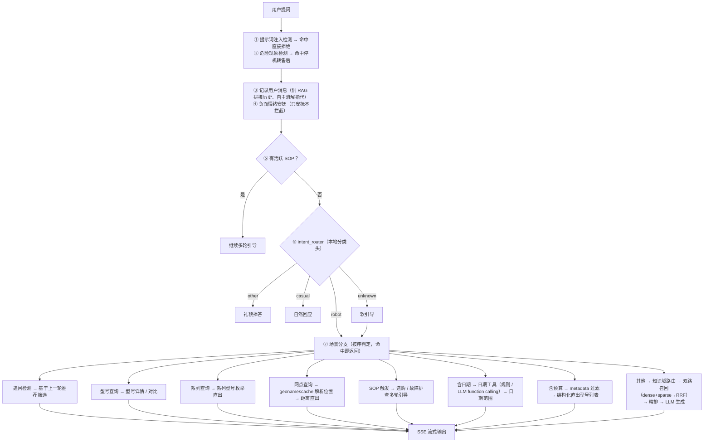

# 扫地机器人智能客服（clean_robot_agent）

基于 **RAG（检索增强生成）** 与 **本地大模型** 的扫地机器人智能客服系统。支持自然语言问答、预算内产品推荐、故障排查、使用维护等场景，全部模型本地化部署，无需云端 API。

## 核心特性

- **双路召回 + 精排**：稠密检索（bge-m3 向量）+ 稀疏检索（BM25 关键词）→ RRF 融合 → Cross-Encoder 精排，兼顾语义近似、精确关键词匹配与长尾噪声压制
- **意图分类**：本地深度学习分类头（bge-m3 embedding + Linear 分类器）前置判断用户意图，毫秒级推理
- **结构化查询**：识别"预算 1000 以内""净白 S 系列"等约束，通过 Chroma metadata 过滤精确枚举预算内/系列内产品；支持"云顶 X2 多少钱"等型号属性精准查询
- **工具调用**：LLM function calling，内置日期/预算/故障分类/型号提取/售后网点五个工具，支持"最近半年""一千来块"等口语化结构化提取
- **多轮 SOP 引导**：选购推荐、故障排查等场景按标准流程多轮引导，进入时给开场提示，支持追问（比较新/更便宜/最贵）与最近发布查询
- **售后网点定位**：识别"最近的售后网点"等查询，通过 geonamescache 离线解析城市经纬度 + Haversine 距离排序返回最近网点，重名城市（如"洛阳"）多轮消歧
- **Redis 可选接入**：SOP 会话状态、会话并发锁、热更新摄入锁迁移到 Redis（分布式锁/跨实例共享），未配置 Redis 时自动降级到本地内存，功能不受影响
- **知识库分域**：按场景（品牌/选购/型号/故障/售后/维护 6 域）定向检索对应知识域，避免跨域词带偏召回
- **品牌化**：全面转型"不染一尘"品牌专属客服；品牌咨询、售后咨询走 RAG 直答，安全危险现象前置拦截
- **情绪安抚**：识别负面情绪（投诉/烦躁等）前置安抚，只安抚不拦截
- **流式输出**：SSE 流式返回答案，前端逐字渲染
- **知识库热更新**：每 30 分钟自动扫描 `data/knowledge/`，检测文件增删改并增量入库
- **多轮友好**：领域外问题礼貌拒答，模糊问题软引导，闲聊自然回应
- **多会话与上下文**：按会话（session_id）隔离多轮对话，对话持久化到本地（jsonl + meta），支持新建/切换/删除历史会话，首轮回答后自动生成 LLM 语义标题与更新时间；自由指代通过拼接历史由 LLM 自主消解

## 技术栈

| 层 | 技术 |
|----|------|
| 前端 | Flask + 原生 HTML/CSS/JS |
| 检索 | Chroma（向量库）+ BM25（rank-bm25）+ RRF 融合 + bge-reranker-v2-m3 精排 |
| Embedding | bge-m3（本地 Ollama） |
| 生成模型 | qwen2.5:7b（本地 Ollama） |
| 意图分类 | bge-m3 + PyTorch 分类头（本地推理） |
| 文档解析 | pypdf + Docling + 标准库多策略 |

## 目录结构

```
clean_robot_agent/
├── config/                      # 配置文件（实际配置 + _template 模板）
│   ├── agent.yaml               # Agent/LLM 配置（含模型名、温度）
│   ├── rag.yaml                 # RAG 配置（分块、检索、RRF 参数）
│   ├── chroma.yaml              # Chroma/embedding 配置
│   ├── prompts.yaml             # Prompt 文件路径
│   ├── word_dict_config.py      # 词表配置中心（情绪/退出/域/触发/症状等词表集中管理）
│   └── *_template.yaml          # 对应模板（含注释说明，复制后填值）
├── data/
│   ├── knowledge/               # 知识库源文件（txt/pdf，热更新监控目录）
│   ├── knowledge_example/       # 知识库格式模板示例
│   ├── datasets/                # 意图分类训练数据集（JSONL）
│   ├── context/                 # 对话上下文持久化（jsonl，按会话分文件）
│   ├── service_point/           # 售后网点数据（网点清单，城市坐标由 geonamescache 提供）
│   ├── bgm_model/               # 训练好的分类头模型
│   ├── pkl/                     # BM25 pickle 缓存
│   ├── state/                   # 热更新指纹快照
│   └── vector_store/            # Chroma 持久化向量库
├── prompts/                     # Prompt 模板（system/摘要/报告）
├── tools/                       # 核心工具模块（详见下节）
├── function_tools/              # LLM 工具调用（function calling）工具
│   ├── date_tool.py             # 日期计算工具（绝对/相对日期 → 日期范围）
│   ├── budget_tool.py           # 预算提取工具（规则 miss 时 function calling 兜底）
│   ├── symptom_tool.py          # 故障现象分类工具（规则 miss 时 function calling 兜底）
│   ├── model_tool.py            # 型号提取工具（7b 提取型号名，精准检索型号详情）
│   └── service_point_tool.py    # 售后网点工具（geonamescache 离线解析城市 + Haversine 距离）
├── sops/                        # SOP 标准操作流程（多轮引导）
│   ├── base.py                  # 会话状态（按 session_id 隔离）+ 执行器 + 知识域定义
│   ├── purchase.py              # 选购推荐 SOP
│   └── repair.py                # 故障排查 SOP
├── test_scripts/                # 分模块测试（按模块命名，run_tests.py 聚合）
│   ├── run_tests.py             # 聚合入口：python run_tests.py [--e2e]
│   ├── _runner.py               # 共享断言/汇总/e2e 门控
│   ├── test_intent.py           # 意图分类（robot/other/casual/unknown，需 --e2e）
│   ├── test_purchase_sop.py     # 选购 SOP（SOP 状态机 + 选购推荐流程）
│   ├── test_repair_sop.py       # 故障排查 SOP（症状映射 + 流程）
│   ├── test_context.py          # 上下文存储（append/get_recent/meta/UUID 校验）
│   ├── test_metadata.py         # 结构化提取（价格/日期/型号/系列/过滤）
│   ├── test_function_tools.py   # 日期/预算/型号/症状/网点五个工具
│   ├── test_retrieval.py        # 检索链路（域路由/分词/过滤/RRF/阈值/精排/条目切分）
│   ├── test_agent_guards.py     # Agent 前置防护（情绪/注入/危险/退出意图）
│   └── test_dialogue.py         # 多轮实战对话（正常 + 非人类，需 --e2e）
├── intent_classifier_training/  # 意图分类模型训练工具
│   ├── build_intent_dataset.py  # 数据集构建（从知识库抽取 + 规则改写）
│   └── train_intent_classifier.py # 分类头训练脚本
├── webapp/
│   ├── app.py                   # Flask 后端（上传/问答/流式接口 + 会话 API）
│   └── templates/index.html     # 聊天前端（新建/历史对话）
├── requirements.txt
└── .gitignore
```

> `temp/`（数据处理脚本）、`Multi_Route_Retrieval/`（双路召回 demo）为独立用途遗留目录，已 gitignore，不参与运行。

## 核心模块说明（tools）

| 模块 | 职责 |
|------|------|
| `agent.py` | RAG 编排：意图路由 → 知识域路由 → 检索 → 结构化直出或 LLM 生成 |
| `intent_router.py` | 意图分类：本地分类头（bge-m3 + Linear）判 robot/casual/other/unknown |
| `hybrid_retriever.py` | 召回编排：dense + sparse → RRF 融合 → 精排 → 截断 |
| `vector_store.py` | Chroma 稠密检索、入库、metadata 过滤、稀疏索引构建 |
| `sparse_retriever.py` | BM25 关键词检索（含 pickle 持久化缓存） |
| `rrf_fusion.py` | RRF（倒数排名融合）算法 |
| `reranker.py` | Cross-Encoder 精排（bge-reranker-v2-m3，本地推理；不可用时降级回 RRF 顺序）|
| `metadata_extractor.py` | 结构化元数据：价格提取、预算解析、发布时间提取、型号信息抽取 |
| `entry_splitter.py` | 编号条目分块器（每个问答/型号一个 chunk） |
| `hot_ingest.py` | 知识库热更新：定时扫描 + 增量入库 |
| `file_tools.py` | 文档多策略解析（txt/pdf/csv/docx） |
| `llm_tool.py` | LLM / embedding 工厂（含 function calling） |
| `log_tool.py` | 日志（控制台彩色 + 文件，按 `logs/<模块>/<日期>/` 分目录） |
| `config_tool.py` / `path_tool.py` / `prompts_tool.py` | 配置 / 路径 / Prompt 加载 |
| `context_store.py` | 会话上下文：按 session_id 持久化最近 6 轮对话（jsonl）+ meta 元数据（LLM 标题）+ 会话增删查改 |
| `redis_store.py` | Redis 连接封装 + 互斥锁（SET NX）+ 降级回退：无 Redis 时自动回退本地内存 |

## 工具调用模块（function_tools/）

| 模块 | 职责 |
|------|------|
| `date_tool.py` | 日期计算工具：`calc_date_range` 把"最近半年""2025年三月"等表达换算成日期范围 |
| `budget_tool.py` | 预算提取工具：规则 miss 时用 3b function calling 提取预算上限（"一千来块"等） |
| `symptom_tool.py` | 故障分类工具：规则 miss 时用 3b function calling 归类口语故障（"奇怪的声音"等） |
| `model_tool.py` | 型号提取工具：7b function calling 提取型号名（含上下文指代），按型号名精准检索详情；支持属性维度精准查询 |
| `service_point_tool.py` | 售后网点工具：geonamescache 离线解析城市经纬度（中文名/重名候选）+ Haversine 距离排序 + 网点格式化 |

## SOP 模块（sops/）

| 模块 | 职责 |
|------|------|
| `base.py` | SOP 基础设施：会话状态 + 执行器（ask/action/reply 三步式状态机）+ 知识域定义（DOMAIN_MAP）+ 追问处理（比较新/更便宜）+ 最近发布查询 |
| `purchase.py` | 选购推荐 SOP：收集预算（上限/下限/区间/浮动）+ 宠物 → 结构化推荐 |
| `repair.py` | 故障排查 SOP：问现象 → 检索 → LLM 生成排查步骤 |

## 快速开始

### 1. 环境要求

- Python 3.13+
- [Ollama](https://ollama.com)（本地已运行）
- 内存 ≥ 20GB（Ollama 三模型常驻：bge-m3 + qwen2.5:3b + qwen2.5:7b；精排模型再占约 2.5GB，不需要时可用 `rag.yaml` 的 `rerank.enabled: false` 省下）

### 2. 安装依赖

```bash
pip install -r requirements.txt
```

### 3. 拉取模型

**Ollama 模型**（embedding + 生成 + 兜底）：

```bash
ollama pull bge-m3        # embedding 模型
ollama pull qwen2.5:7b    # 生成模型 + 型号提取（function calling）
ollama pull qwen2.5:3b    # 预算/故障现象 function calling 兜底（可选）
```

**精排模型 `bge-reranker-v2-m3`**（约 2.2GB）：它不是 Ollama 模型——Ollama 没有 rerank 端点，
由 `tools/reranker.py` 走 transformers 本地推理，**首次检索时自动从 HuggingFace 下载并缓存**，
无需手动执行命令。国内网络慢可先设镜像再启动：

```bash
export HF_ENDPOINT=https://hf-mirror.com
# PowerShell: $env:HF_ENDPOINT="https://hf-mirror.com"
```

也可提前手动下载：

```bash
python -c "from huggingface_hub import snapshot_download; snapshot_download('BAAI/bge-reranker-v2-m3')"
```

加载时**优先只用本地缓存**（避免每次启动都卡在联网校验上），缓存未命中才联网；加载失败会记
WARNING 并降级为「不精排」，功能不受影响。需要换用其它 reranker 时改 `rag.yaml` 的 `rerank.model`。

### 4. 配置

复制模板为实际配置，填入你的参数：

```bash
cp config/agent_template.yaml  config/agent.yaml
cp config/rag_template.yaml    config/rag.yaml
cp config/chroma_template.yaml config/chroma.yaml
cp config/prompts_template.yaml config/prompts.yaml
```

### 5. 训练意图分类头（首次必需）

意图分类头（`data/bgm_model/`）是**训练产物、已 gitignore**，仓库里不包含，
**首次运行前必须先训练**，否则启动后首次提问会报错（找不到分类头文件）：

```bash
python intent_classifier_training/build_intent_dataset.py
python intent_classifier_training/train_intent_classifier.py
```

训练会用 Ollama bge-m3 生成 embedding（需 §3 的模型已就绪），产物输出到 `data/bgm_model/`。
详见下方「意图分类模型训练」。

### 6. 启动

```bash
python webapp/app.py
```

浏览器打开 `http://localhost:5050`。

## 知识库管理

知识库源文件放在 `data/knowledge/` 下，支持 `.txt/.md/.pdf/.csv/.docx/.pptx/.xlsx`。

**文档格式规范**（详见 `data/knowledge_example/格式模板.txt`）：

```
## 入门级（1500 元以下）
1. **米家扫拖机器人 M20**
   - 吸力：2800Pa｜导航：LDS激光｜避障：红外
   - 参考价：899
```

核心规则：
- 每个条目以 `数字. ` 开头
- 型号名/问题用 `**加粗**`
- 参数用 `｜` 分隔，值内不能有空格
- 价格独立一行 `参考价：数字`
- 发布时间独立一行 `发布时间：YYYY-MM-DD`（用于"最近半年""2025年三月"等新品查询）

**热更新**：放入新文件后，系统每 30 分钟自动检测并入库；重启 Flask 会立即触发一次扫描。

## 意图分类模型训练

系统用**本地分类头**做意图分类（bge-m3 embedding + Linear 1024→4），毫秒级、不调 LLM；
分类头文件缺失时会直接报错，**首次运行前必须先训练一次**（见「快速开始 §5」）。

**重新训练**（当需要扩充数据集时）：

```bash
# 1. 构建数据集（从知识库抽取 robot 样本 + 内置 other/casual/unknown）
python intent_classifier_training/build_intent_dataset.py

# 2. 训练分类头（bge-m3 embedding + Linear 分类器）
python intent_classifier_training/train_intent_classifier.py
```

训练产物输出到 `data/bgm_model/`，推理时由 `intent_router.py` 自动加载。

## 配置说明

| 配置 | 关键项 |
|------|--------|
| `agent.yaml` | `llm.model`（主生成模型）、`llm.small_model`（轻量兜底模型）、`behavior.retrieval_only`（纯检索模式开关） |
| `rag.yaml` | `chunk.chunk_size`、`retrieval.dense_top_k/sparse_top_k/final_top_k/score_threshold`、`rrf.*`、`rerank.*`（精排开关/模型/候选宽度/阈值） |
| `chroma.yaml` | `persist_dir`、`collection_name`、`embedding.model` |
| `redis.yaml` | `host`/`port`/`password`（Redis 连接）、`sop_ttl`（SOP 会话过期）、`lock_ttl`（锁过期） |

## 问答流程



## 注意事项

- 所有模型本地运行，无云端依赖；其中精排模型 `bge-reranker-v2-m3`（约 2.2GB）首次运行需联网下载（见「快速开始 §3」），加载失败会自动降级为“不精排”，也可在 `rag.yaml` 设 `rerank.enabled: false` 主动关闭
- Redis 为可选依赖：未配置 `config/redis.yaml` 时，SOP 会话状态/并发锁/摄入锁自动降级到本地内存，功能不受影响
- `data/vector_store/`、`data/pkl/`、`data/state/`、`data/bgm_model/`、`data/context/`、`data/context_meta/` 为运行时产物，已加入 `.gitignore`
- 配置文件 `config/*.yaml`（非 template）含本地环境信息，已加入 `.gitignore`
